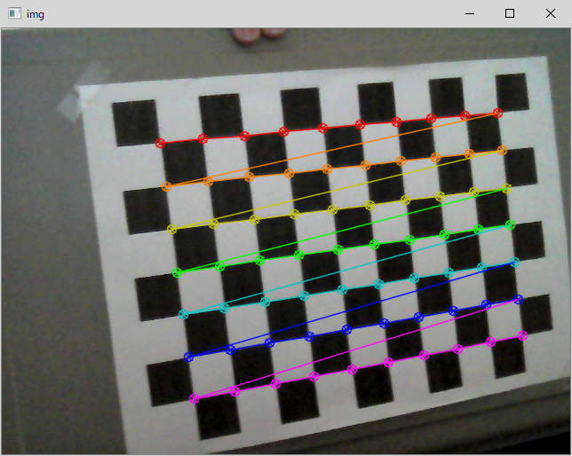
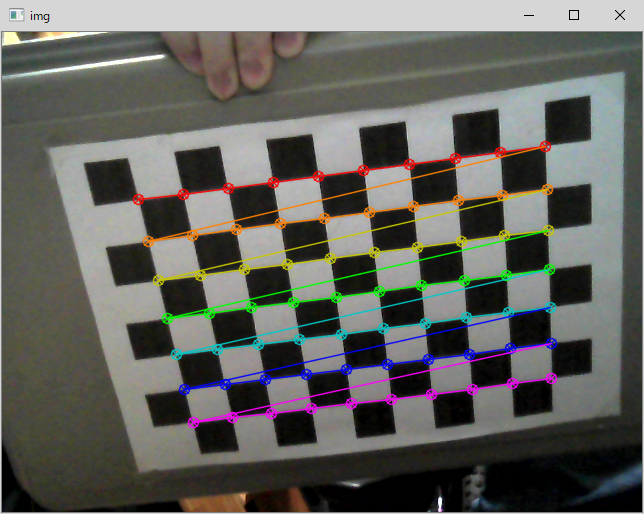
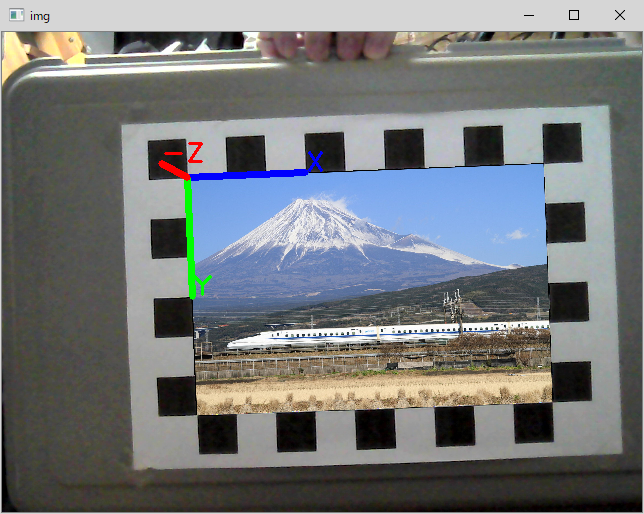

# camera-calibration-for-openvino-demos

## Description
This is a set of utility programs to generate the camera calibration data for OpenVINO sample programs (human_pose_estimation_3d_demo).  
The camera intrinsics and extrinsics data is required to project the 3d points to 2d view-port image. The intrinsics data is a dedicated data for a paticular camera. It includes focal-length, lens distortion information and so on. As long as the lens setting (such as focal length) of the camera is the same, the same intrinsics data is valid. In contrast, extrinsics data depends on the camera position and orientation. The data includes rotation and translation matrics data. If you have moved the camera or changed the line of sight of the camera, you need to update the extrinsics data so that the progarm can project the 3d points to 2d view-port image correctly.  

## Programs
This project includes 2 programs.
1. `camera_calibration.py`  
 Capture calibration data from multiple images and calculate the intrincics parameters (usually, it requires >10 images). You need to print out the chess board pattern and glue it on a flat panel. The program will capture the images with a webCam and calculate the calibration data from the images which includes the known chess board pattern. A file with intrinsics parameter will be generated (`calib.npz`)  

2. `extrinsics_parameter_extractor.py`  
Take the intrinsics parameter generated by `camera_calibration.py` and generates extrinsics parameters. You need to place the chess board pattern at the position where you want to set the point of origin of the world coordinate. The chess board orientation is also important. If you tilt or rotate the chess board pattern, the world coordinate will be fixed at that orientation. The program will generate the extrinsics parameter which can be consumed by the `human_pose_estimation_3d_demo` OpenVINO sample program.  



```sh
python camera_calibration.py
*** CAMERA CALIBRATION TOOL for OPENCV ***

Present 10x7 chess board pattern to the webCam
The detected corners will be marked when the program detects the corners
Calibration may require >10 data to generate accurate camera matrix and distortion data
Keys:
  SPACE : Capture a chess board corner data
  'c'   : Generate the camera calibration data and exit the program
  ESC   : Exit the program
Captured : 1
Captured : 2
Captured : 3
   :       :
Captured : 24
Captured : 25
Calculating...RMS= 0.39897652734715605
[[908.61829914   0.         338.45438122]
 [  0.         911.71071038 240.00282302]
 [  0.           0.           1.        ]] [[-0.06206214 -0.101321   -0.00262832 -0.00189168  1.00581181]]
camera parameters are saved ('calib.npz')
```

```sh
python extrinsic_parameter_extractor.py
{
    "R": [
        [
            0.9996452033615095,
            0.024975914993181445,
            0.009255866603382283
        ],
        [
            -0.025043028575883638,
            0.9996603926413941,
            0.007207364553100276
        ],
        [
            -0.009072712718570377,
            -0.007436602336227554,
            0.9999311890473359
        ]
    ],
    "t": [
        -3.671360265277327
    ]
}
extrinsics.json is generated
```
